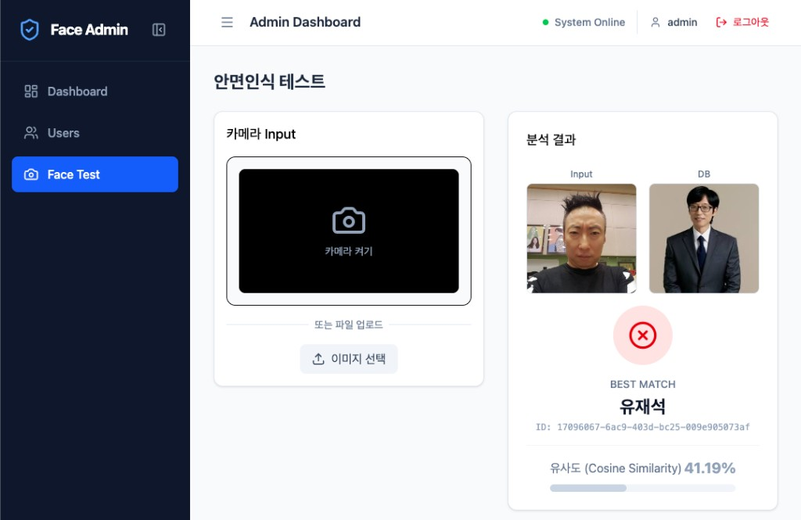
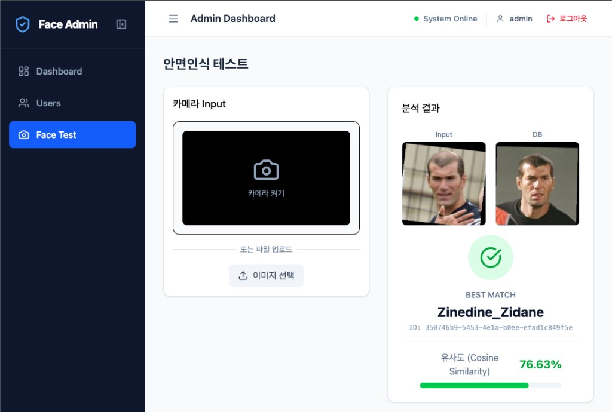
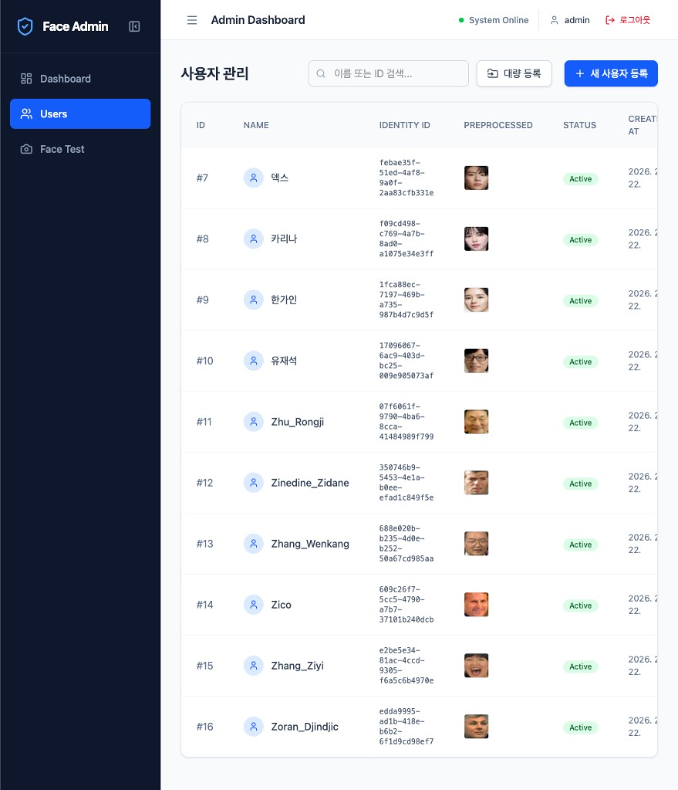

# Face Recognition Server & Admin Dashboard

> FastAPI + ONNX Runtime 기반 얼굴 인식 서버와 React 관리자 대시보드를 포함한 모노레포. 사용자 얼굴을 임베딩으로 등록하고, 업로드된 사진과 저장된 임베딩 간 코사인 유사도로 신원을 식별한다.

## 주요 기능 (Key Features)

- **얼굴 등록 (Face Registration)**: 사용자 얼굴 이미지를 업로드해 임베딩으로 등록
- **얼굴 검색 (Face Search)**: 업로드한 사진으로 등록 사용자와 코사인 유사도 매칭
- **사용자 관리 (User Management)**: 사용자 CRUD 및 활성/비활성 관리
- **일괄 등록 (Bulk Registration)**: 서버 측 디렉터리 경로로 다수 사용자 일괄 등록
- **관리자 대시보드 (Admin Dashboard)**: JWT 로그인 후 사용자·등록·검색 테스트 UI
- **Docker 기반 배포**: 개발/프로덕션용 Docker Compose로 풀스택 실행

## 동작 예시 (Usage / Workflow Examples)

| 설명 | 스크린샷 |
|------|----------|
| **안면인식 테스트 — 매칭 실패 예시** (Input vs DB, 유사도 41.19%, 임계값 미달) |  |
| **안면인식 테스트 — 매칭 성공 예시** (Zinedine_Zidane, 유사도 76.63%) |  |
| **사용자 관리 — 등록 사용자 목록 및 전처리 얼굴 썸네일** |  |

## 기술 스택 (Tech Stack)

| 구분 | 기술 |
|------|------|
| **Backend** | FastAPI, ONNX Runtime, OpenCV(YuNet), SQLAlchemy 2.0(async) + aiosqlite, Loguru, JWT(Python-Jose), Passlib+Bcrypt |
| **Frontend** | React 19, TypeScript, Vite, TailwindCSS v4, React Router, Axios |
| **Infrastructure & DB** | Docker / Docker Compose, Nginx(프론트 정적·리버스 프록시), SQLite |

## 프로젝트 구조 (Directory Layout)

```
face_recognition_server/
├── client/                 # React Admin Dashboard
│   ├── src/
│   ├── Dockerfile          # Production (Nginx)
│   ├── Dockerfile.dev      # Development (Vite dev server)
│   ├── nginx.conf
│   └── package.json
├── server/                 # FastAPI Face Recognition Server
│   ├── app/
│   │   ├── api/            # API 엔드포인트 (auth, users, face, health)
│   │   ├── core/           # 설정, 로거
│   │   ├── db/             # 모델, 세션, 초기 관리자
│   │   ├── services/       # 비즈니스 로직 (AI 서비스 등)
│   │   └── utils/          # 전처리, 인식(코사인 유사도)
│   ├── main.py
│   ├── Dockerfile
│   ├── requirements.txt
│   └── .env.example
├── docs/                   # 상세 설계·스키마·계획 문서
├── docker-compose.yml      # Production
├── docker-compose.dev.yml  # Development (hot-reload)
└── README.md
```

## 빠른 시작 (Quick Start)

### 1. 사전 준비 (Prerequisites)

- **Docker + Docker Compose** (권장): 풀스택 한 번에 실행
- 로컬만 사용 시: **Python 3.9+**, **Node.js 18+** (서버는 `uv` 사용 권장)

### 2. 환경 변수 설정

서버 실행 전 `server/.env`를 준비한다. `server/.env.example`을 복사한 뒤 필수 값을 채운다.

```bash
cd server
cp .env.example .env
# .env 편집: MODEL_PATH, DATABASE_URL, SECRET_KEY, SUPERUSER_* 등 (아래 표 참고)
```

필수 환경 변수는 [환경 변수](#환경-변수-environment-variables) 섹션을 참고한다.

### 3. 실행 방법

#### 옵션 A: Docker Compose (풀스택, 권장)

```bash
# Development (서버·클라이언트 hot-reload)
docker-compose -f docker-compose.dev.yml up --build

# Production
docker-compose up --build
```

| 모드 | Frontend | Backend API | API 문서 |
|------|----------|-------------|----------|
| Development | http://localhost:5173 | http://localhost:8000 | http://localhost:8000/docs |
| Production | http://localhost:5173 | http://localhost:8000 | http://localhost:8000/docs |

#### 옵션 B: 서버만 로컬 실행

```bash
cd server
uv pip install --system -r requirements.txt   # 또는: pip install -r requirements.txt
uvicorn main:app --host 0.0.0.0 --port 8000 --reload
```

#### 옵션 C: 클라이언트만 로컬 실행

```bash
cd client
npm install
npm run dev   # http://localhost:5173 (Vite dev; /api는 proxy로 백엔드에 전달)
# 기타: npm run build, npm run lint, npm run preview
```

로컬에서 클라이언트만 쓸 때는 백엔드 URL이 필요하다. `docker-compose.dev.yml` 기준으로는 백엔드가 `http://localhost:8000`이면, Vite proxy 설정(`/api` → 백엔드)이 로컬에서도 동작하도록 되어 있어야 한다. Docker 외부에서 실행 시 `vite.config.ts`의 proxy target을 `http://localhost:8000` 등으로 맞추면 된다.

## 환경 변수 (Environment Variables)

서버(`server/`)에서 사용하는 주요 환경 변수다. `server/app/core/config.py` 및 `server/.env`와 일치시켜야 한다.

| 변수 | 필수 | 설명 |
|------|------|------|
| `MODEL_PATH` | ✅ | 얼굴 인식 ONNX 모델 파일 경로 |
| `DATABASE_URL` | ✅ | DB 연결 URL (예: `sqlite+aiosqlite:///./face_db.db`) |
| `SECRET_KEY` | ✅ | JWT 서명 키 |
| `SUPERUSER_ID` | ✅ | 최초 관리자 로그인 ID |
| `SUPERUSER_PASSWORD` | ✅ | 최초 관리자 비밀번호 |
| `SUPERUSER_EMAIL` | ✅ | 최초 관리자 이메일 |
| `FACE_MATCH_THRESHOLD` | | 매칭 임계값 (기본 `0.70`) |
| `DETECTION_MODEL_PATH` | | YuNet 얼굴 검출 모델 경로 (기본값 있음) |
| `LOG_LEVEL` | | 로그 레벨 (기본 `INFO`) |
| `LOG_FILE_PATH` | | 로그 파일 경로 (기본 `logs/server.log`) |

`.env.example`에는 일부 항목만 있을 수 있으므로, 위 표와 `app/core/config.py`를 기준으로 필요한 변수를 모두 설정한다.

## API 및 인증 요약

- 모든 API prefix: **`/api/v1`**
- 인증: JWT Bearer. `POST /api/v1/auth/login`으로 토큰 발급 후, 사용자·검색 등 보호된 라우트에 `Authorization: Bearer <token>` 헤더 필요.
- 대시보드: `/login`에서 관리자 로그인 → `/users`, `/users/new`, `/users/bulk`, `/test`(얼굴 검색 테스트) 등 사용.

| 구분 | 경로 예시 | 인증 |
|------|-----------|------|
| 로그인 | `POST /api/v1/auth/login` | 없음 |
| 현재 관리자 | `GET /api/v1/auth/me` | 필요 |
| Raw 추론 | `POST /api/v1/face/inference` | 없음 |
| 사용자 등록 | `POST /api/v1/users/register` | 필요 |
| 일괄 등록 | `POST /api/v1/users/register/bulk` | 필요 |
| 얼굴 검색 | `POST /api/v1/users/search` | 필요 |
| 사용자 CRUD | `GET/PATCH/DELETE /api/v1/users/...` | 필요 |

상세 API는 서버 실행 후 **Swagger UI** (http://localhost:8000/docs) 또는 **ReDoc** (http://localhost:8000/redoc) 참고.

## 문서 (Documentation)

상세 설계·아키텍처·DB·계획은 `docs/`를 참고한다.

- [00_overview_and_index.md](docs/00_overview_and_index.md) — 프로젝트 개요 및 문서 목차
- [01_architecture.md](docs/01_architecture.md) — 시스템 아키텍처, 3계층, API·클라이언트 라우트, 추론 파이프라인
- [02_design_patterns.md](docs/02_design_patterns.md) — 디자인 패턴(싱글톤, DI, DTO, 인증)
- [03_logging_strategy.md](docs/03_logging_strategy.md) — 로깅 전략(Loguru)
- [04_database_schema.md](docs/04_database_schema.md) — DB 스키마(User, Admin, PredictionLog)
- [05_adr.md](docs/05_adr.md) — 아키텍처 결정 기록(ADR)
- [06_develop_plan.md](docs/06_develop_plan.md) — 향후 개발 계획

개발 시 참고용 상세 명령·구조는 루트의 **CLAUDE.md**에도 정리되어 있다.

## HTTPS (선택)

기본 Docker 이미지는 HTTP(80)만 사용한다. HTTPS를 쓰려면:

1. **인증서 준비**: `client/ssl/` 디렉터리에 `nginx.crt`, `nginx.key`를 둔다. `client/ssl/`은 `.gitignore`에 포함되어 있으므로 **저장소에 커밋하지 않는다**.
2. **Docker 실행 시 마운트**: `-v $(pwd)/client/ssl:/etc/nginx/ssl` 로 볼륨 마운트.
3. **Nginx HTTPS 설정**: `client/nginx-ssl.conf.example` 내용을 참고해 HTTPS 서버 블록을 `/etc/nginx/conf.d/`에 추가한다 (예: 컨테이너 내부에 복사하거나 별도 볼륨으로 마운트).

Docker Compose 사용 시 `docker-compose.yml`의 client 서비스에 `volumes: - ./client/ssl:/etc/nginx/ssl` 및 HTTPS용 설정 파일 마운트를 추가하면 된다.

## 트러블슈팅

- **포트 충돌**: `docker-compose.yml` / `docker-compose.dev.yml`에서 `ports`를 변경해 사용한다.
- **Mac M1/M2 ONNX 메모리**: Apple Silicon에서는 CoreML provider 사용 시, 필요 시 ONNX 세션 옵션(메모리 패턴/arena 등) 조정을 검토한다.
- **Docker 빌드 오류**: `docker-compose down` 후 `docker-compose build --no-cache`로 재빌드한다.
